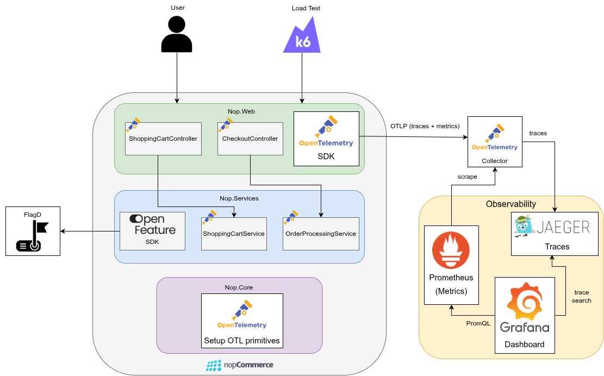

## Observability Assignment — AS Assignment 1

This fork adds OpenTelemetry tracing and metrics to the **Customer Places an Order** flow as part of Software Architecture Assignment 1.

Made by: Rodrigo Abreu, 113626

---

### Architecture Diagram



---

### How to Build and Run

**Prerequisites:** Docker, Docker Compose

```bash
docker compose up --build
```

Wait ~60s for nopCommerce to initialise, then visit:

| Service | URL |
|---|---|
| Store | http://localhost:80 |
| Grafana | http://localhost:3000 (admin / admin) |
| Jaeger | http://localhost:16686 |
| Prometheus | http://localhost:9090 |

---

### How to Run the Load Test

Run the bash script.
```bash
./assessment/load-test/start-load-test.sh
```

Or run it manually.
```bash
docker run --rm -i --network host \
  -e BASE_URL=http://localhost \
  -e PRODUCT_SKU=LE_TX1_CL \
  -e COUNTRY_NAME=Portugal \
  -e PAYMENT_METHODS="Payments.CheckMoneyOrder,Payments.Manual" \
  -v "$PWD:/work" \
  grafana/k6 run /work/assessment/load-test/k6/checkout-order-flow.js
```

---

### Observability Stack

| Component | Role | Port |
|---|---|---|
| OTel Collector | Receives OTLP from nopCommerce; routes traces → Jaeger, metrics → Prometheus | 4317 (gRPC) |
| Jaeger | Trace storage and UI | 16686 |
| Prometheus | Metrics storage | 9090 |
| Grafana | Dashboards — auto-provisioned from `assessment/observability/grafana/` | 3000 |
| FlagD | Feature flag daemon — hot-reloads `assessment/observability/flagd/flags.json` | 8013 |

---

### Further Reading

- [REPORT.md](REPORT.md) — instrumentation reference: spans, metrics, PII strategy, feature flag, load testing, dashboard guide
- [ANALYSIS.md](ANALYSIS.md) — pre-instrumentation architectural analysis of nopCommerce
- [CRITIQUE.md](CRITIQUE.md) — what helped, what hindered, and architectural changes going forward
