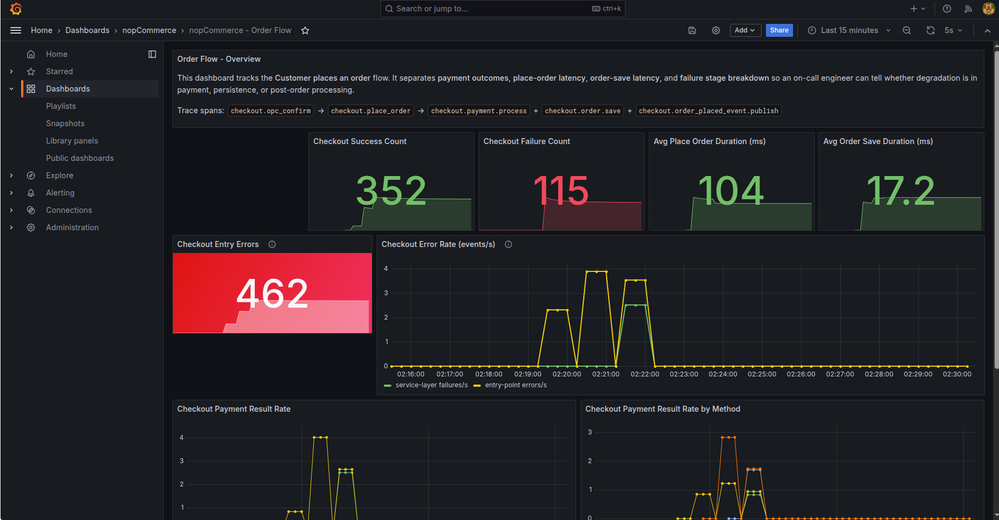
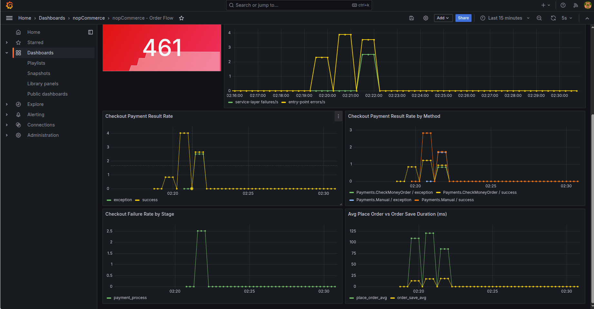
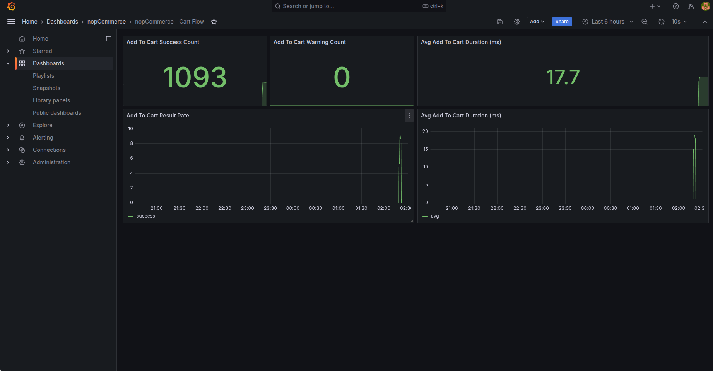

# Instrumentation Report — AS Assignment 1

---

## Instrumented Flow

**Customer Places an Order** — covering Cart, Checkout, Payment, and Persistence.

### Span Tree

```
POST /checkout/OpcConfirmOrder
└── checkout.opc_confirm            [CheckoutController]
    └── checkout.place_order        [OrderProcessingService.PlaceOrderAsync]
        ├── checkout.payment.process
        ├── checkout.order.save
        └── checkout.order_placed_event.publish

POST /addproducttocart/catalog/{productId}/{...}
└── cart.add.service                [ShoppingCartService.AddToCartAsync]
```

---

## Spans

| Span | Started In | Wraps | Purpose |
|---|---|---|---|
| `checkout.opc_confirm` | `CheckoutController` | Full OPC confirm action | Entry point for the OPC confirm action. Captures the full controller-layer latency including session validation. Errors here indicate client/session problems before any business logic runs. |
| `checkout.place_order` | `OrderProcessingService.PlaceOrderAsync` | Entire order placement logic | Root business span for the entire order placement. All child spans nest under this. Duration here is the user-visible checkout latency at the service layer. |
| `checkout.payment.process` | `OrderProcessingService.PlaceOrderAsync` | `IPaymentPluginManager.ProcessPaymentAsync` call | Isolates payment processing latency and outcome from the rest of order placement. A failure here means the payment step specifically failed: not tax, not shipping, not database. |
| `checkout.order.save` | `OrderProcessingService.PlaceOrderAsync` | `EntityRepository<Order>.InsertAsync` call | The only non-retryable step in checkout. If this span's duration spikes while `checkout.place_order` is stable, the overhead is in post-save processing (cache invalidation, email dispatch). |
| `checkout.order_placed_event.publish` | `OrderProcessingService.PlaceOrderAsync` | `IEventPublisher.PublishAsync` call | Wraps the event fan-out to all `OrderPlacedEvent` consumers. Slow consumers will show up here without affecting the payment or save spans. |
| `cart.add.service` | `ShoppingCartService.AddToCartAsync` | Entire add-to-cart logic | Instruments the add-to-cart operation separately from checkout. Useful for distinguishing cart-layer problems (stock checks, attribute validation) from order-layer problems. |

### Span Tags

All tags are operational — no PII. The `TelemetrySanitizingProcessor` enforces this at export regardless of what any span sets.

| Span | Tag | Why it's there |
|---|---|---|
| `checkout.opc_confirm` | `store.id` | Multi-store support, problems may be store-specific |
| `checkout.opc_confirm` | `checkout.cart_item_count` | High item counts correlate with slow tax/shipping calculation |
| `checkout.opc_confirm` | `checkout.customer_is_guest` | Guest vs registered checkout follows different code paths |
| `checkout.opc_confirm` | `payment.method.system_name` | Links controller errors to a specific payment method |
| `checkout.opc_confirm` | `checkout.place_order.success` | Binary outcome tag: lets you filter success vs failure traces |
| `checkout.place_order` | `payment.method.system_name` | The key dimension for failure analysis: is it one method or all? |
| `checkout.place_order` | `checkout.is_recurring` | Recurring orders follow a separate code path in `PlaceOrderAsync` |
| `checkout.payment.process` | `payment.status` | The payment plugin's returned status (Paid, Authorized, Pending, etc.) |
| `checkout.payment.process` | `payment.error_count` | Number of error messages returned by the payment plugin |
| `checkout.order.save` | `order.payment_status` | The persisted payment status: confirms what was written to the database |
| `checkout.order.save` | `order.shipping_required` | Shipping-required orders trigger more post-save consumers |
| `cart.add.service` | `product.id` | Identifies which product caused a cart validation failure |
| `cart.add.service` | `cart.type` | Shopping cart vs wishlist |
| `cart.add.service` | `result` | success / warning / error, matches the counter label |

---

## Metrics

| Metric | Type | Labels | Justification |
|---|---|---|---|
| `checkout_payment_result_total` | Counter | `payment_method`, `result`, `store_id` | The most actionable metric in the dashboard. Labelled by payment method so a spike in failures for one method while another succeeds immediately rules out infrastructure and points to plugin configuration. |
| `checkout_place_order_duration_ms` | Histogram | `store_id` | End-to-end service-layer latency for order placement. Compare with `checkout_order_save_duration_ms` to locate where time is being spent. |
| `checkout_order_save_duration_ms` | Histogram | `store_id` | Isolates the irreversible database commit step. A p99 spike here while `checkout_place_order_duration_ms` is stable indicates post-save processing overhead, not pre-save logic. |
| `checkout_place_order_failures_total` | Counter | `stage`, `store_id` | Service-layer failures labelled by stage (`payment`, `save`, `unknown`). Tells an on-call engineer which stage of `PlaceOrderAsync` failed. |
| `checkout_opc_confirm_errors_total` | Counter | `store_id` | Controller-layer rejections before `PlaceOrderAsync` is ever called. If this rises while `checkout_place_order_failures_total` stays at zero, the problem is client state, not payment infrastructure. |
| `cart_add_result_total` | Counter | `result`, `store_id` | Add-to-cart outcomes labelled by result. Warning results are often the leading indicator of inventory problems. |
| `cart_add_duration_ms` | Histogram | `store_id` | Cart add latency — a different performance concern from checkout latency. |

---

## PII Sanitization

`TelemetrySanitizingProcessor` ([src/Presentation/Nop.Web/Infrastructure/TelemetrySanitizingProcessor.cs](src/Presentation/Nop.Web/Infrastructure/TelemetrySanitizingProcessor.cs)) runs on every span before export and removes any attribute whose key matches: `email`, `name`, `address`, `phone`, `card`, `password`, `customer.id`.

The instrumentation code never sets PII tags, but the processor ensures that even if a future developer adds a tag carelessly, it will be stripped before reaching Jaeger or Prometheus. Redaction happens at the SDK layer (in-process) rather than at the Collector so that infrastructure misconfiguration cannot leak PII.

---

## Feature Flag — Simulated Payment Failures

A [FlagD](https://flagd.dev) sidecar provides runtime feature flags via the [OpenFeature](https://openfeature.dev) standard. The flag `demo-payment-failure-rate` injects payment failures at the service layer without modifying any store configuration.

**Flag file:** `assessment/observability/flagd/flags.json`

```json
{
  "flags": {
    "demo-payment-failure-rate": {
      "state": "ENABLED",
      "variants": { "high": 0.5, "low": 0.1, "off": 0.0 },
      "defaultVariant": "off"
    }
  }
}
```

To activate: change `"defaultVariant"` to `"high"` (50% failure rate) or `"low"` (10%). FlagD hot-reloads the file — no container restart needed. Failures appear in `checkout_place_order_failures_total{stage="payment"}` and `checkout_payment_result_total{result="failure"}`. Affected spans are tagged with `demo.simulated_failure=true`.

---

## Grafana Dashboards

Open Grafana at `http://localhost:3000` → **Dashboards** → **nopCommerce**.

### Order Flow Dashboard

| Panel | What it shows | When to act |
|---|---|---|
| Checkout Success Count | Orders successfully placed | Sharp drop while attempts stay stable → service-layer failures |
| Checkout Failure Count | Service-layer `PlaceOrderAsync` failures | Any non-zero value warrants investigation |
| Avg Place Order Duration | Mean end-to-end checkout latency | > 2s → investigate child spans |
| Avg Order Save Duration | Mean DB commit latency | Spike here while place-order is stable → post-save consumer overhead |
| Checkout Entry Errors | Controller-layer rejections (before business logic) | Rising → client session / antiforgery / cart state problems |
| Checkout Error Rate | Events/s for both failure signal types | Both rising together → infrastructure; only entry errors → client problem |
| Checkout Payment Result Rate by Method | Success/failure rate per payment plugin | One method failing while others succeed → plugin config, not infra |
| Checkout Failure Rate by Stage | Which stage inside `PlaceOrderAsync` fails | `payment` → payment plugin; `save` → database |

### Cart Flow Dashboard

| Panel | What it shows |
|---|---|
| Add-to-Cart Success Count | Successful cart adds |
| Add-to-Cart Warning Count | Adds with warnings (stock, attributes) — leading indicator |
| Avg Cart Add Duration | Cart add latency timeseries |

### Screenshots

- Order flow dashboard



- Cart flow dashboard


---

## Load Testing

Script: `assessment/load-test/k6/checkout-order-flow.js`

Two concurrent scenarios run simultaneously to produce both success and error signals:

**`happy_path` (10 VUs)** — full OPC checkout as guest: antiforgery → add to cart → open checkout → billing → shipping → payment method → confirm order. Produces `checkout_payment_result_total{result="success"}` and duration histograms. VUs pick payment methods round-robin from `PAYMENT_METHODS`.

**`invalid_checkout` (5 VUs)** — skips `OpcSavePaymentMethod` so the payment session is never established. `OpcConfirmOrder` is called without it → nopCommerce throws "Payment information is not entered" at the controller layer → `checkout_opc_confirm_errors_total` increments. Isolates controller-layer rejections from service-layer failures.

### Environment Variables

| Variable | Example | Notes |
|---|---|---|
| `BASE_URL` | `http://localhost` | Required |
| `PRODUCT_SKU` | `LE_TX1_CL` | Required (or `PRODUCT_ID`) |
| `COUNTRY_NAME` | `Portugal` | Required (or `COUNTRY_ID`) |
| `PAYMENT_METHODS` | `Payments.CheckMoneyOrder,Payments.Manual` | Comma-separated; each VU picks one round-robin |

### Load Profile

| Scenario | VUs | Duration |
|---|---|---|
| `happy_path` | 10 | 2m ramp-up + 2m steady |
| `invalid_checkout` | 5 | 2m ramp-up + 2m steady |
